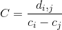
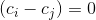

# MscComp

# Executando novas tarefas!

Seguindo as ordens que foi solicitado pelo orientador conforme a lista abaixo:

 1.  Treinar a rede novamente com mais exemplos 7..14  **[OK]**
 2.  Realizar matriz de `i,j` *(Um for dentro do outro)*
 3. Imprimir o  de cada imagem se  então é retirado .

D `i,j` é a distância euclidiana entre o pixel `i` w o pixel `j`

A distancia pode ser calculada através da formula: c = math.sqrt(pow(math.fabs(x1-x0),2) + pow(math.fabs(y1-y0),2))